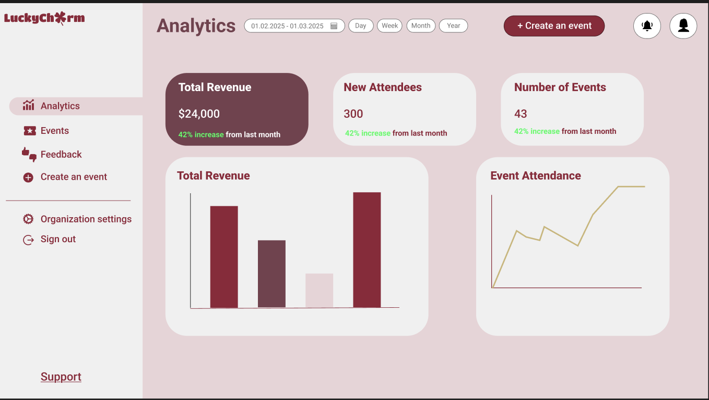

# Figma Design System

This Figma prototype represents the global design system for the webapp, covering:

- Student Portal  
- Organizer Portal  
- Administrator Portal  

It defines consistent **colors, typography, buttons, and layout containers** used across all pages. Individual page mockups were not created; pages follow this unified design system.

## View Prototype
[Figma Prototype](https://www.figma.com/proto/1sl5hedroIndL9fPi9UCMx/SOEN-341?node-id=0-1&t=g8IqLqyKwvlYYuYW-1)

## Preview

